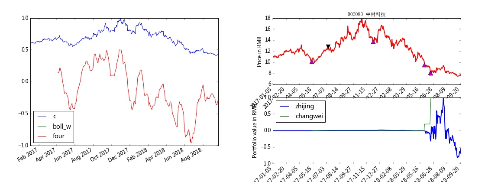

autoxd 回测框架
------

简单快捷的A股回测环境， 适合编写T+0策略

#### 特性
  * 使用pandas编写策略
  * 结果可以在页面显示， 类似matlab的publish
  * 并行执行策略(需要安装redis)
  * 本地账户， 模拟实盘交易细节， 支持T+0， 交易成本计算
  * 基于本地数据(datas)维护的前复权, 成交量转换手率

#### 数据维护
  * datas目录下的数据不定期更新， 数据来自同花顺F10
  * 包括股票代码列表， 股票简写， 前复权使用的分红表， 成交量转换手率的股本变更表

#### 依赖
1. redis 默认使用(推荐)
2. 支持各平台py3, py2已不维护； 开发平台为win， 其它平台测试比较少， 可能有轻微的问题.
3. 推荐conda env python=3.7.4

#### 安装
  * 安装Anaconda
  * 下载autoxd
  ```
  git clone https://github.com/nessessary/autoxd.git
  cd autoxd
  pip install -r requirements.txt
  pip install git+https://github.com/hanxiaomax/pyh.git
  python setup.py install
  ```

#### 使用


- 5分钟例子

```
	python autoxd\strategy\five_chengben.py
```

   </img>

- 日线例子

```
	python boll_fencang.py
```
   <br>


